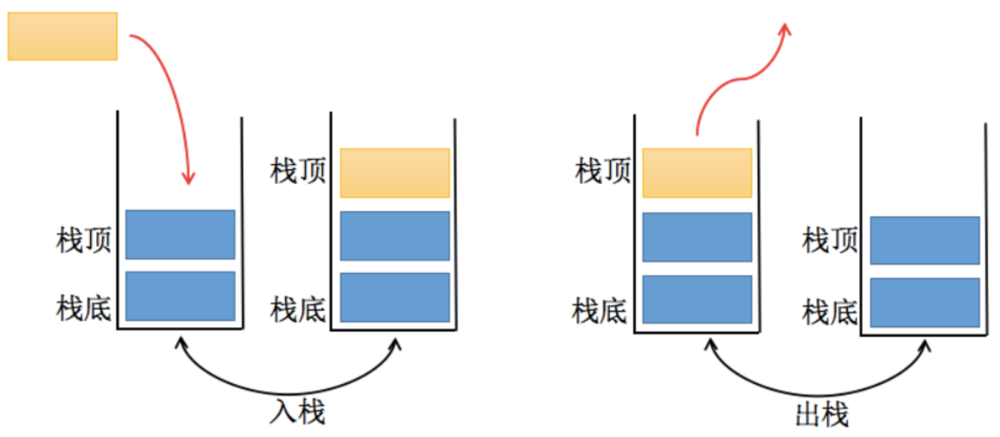

# 栈(stack)结构

栈结构示意图:

::: tip 栈(stack)
是一种受限的线性表，后进先出(LIFO)
:::
* 其限制是允许在 **表的一端** 进行插入和删除运算，这一端称为**栈顶**，另外一端称为**栈低**
* LIFO(last in first out) 表示就是后进入的元素，第一个弹出栈空间
* 向一个栈插入新元素又称作**进栈、入栈、压栈**, 它是把新元素放到栈顶元素的上面，使之成为新的栈顶元素
* 一个栈删除元素又称作**出栈或退栈**，它是把栈顶的元素删除掉，使其相邻的元素成为新的栈顶元素
> JavaScript 代码实现栈结构
```js
// 栈结构的封装
function Stack() {
  this.items=[]
}
// push(item) 压栈操作，往栈里面添加元素
Stack.prototype.push = function (item) {
    this.items.push(item);
  }
  // pop() 出栈操作，从栈中取出元素，并返回取出的那个元素
 Stack.prototype.pop = function () {
    return this.items.pop();
  }
  // peek() 查看栈顶元素
 Stack.prototype.peek = function () {
    return this.items[this.items.length - 1];
  }
  // isEmpty() 判断栈是否为空
 Stack.prototype.isEmpty = function () {
    return this.items.length === 0;
  }
  // size() 获取栈中元素个数
 Stack.prototype.size = function () {
    return this.items.length;
  }
  // toString() 返回以字符串形式的栈内元素数据
Stack.prototype.toString = function () {
  let result = "";
  for (let item of this.items) {
    result += item + " ";
  }
  return result;
}
```
> 测试封装的栈结构
```js
var stack = new Stack()
// push() 测试
stack.push(1);
stack.push(2);
stack.push(3);
console.log(stack.items); //--> [1, 2, 3]

// pop() 测试
console.log(stack.pop()); //--> 3

// peek() 测试
console.log(stack.peek()); //--> 2

// isEmpty() 测试
console.log(stack.isEmpty()); //--> false

// size() 测试
console.log(stack.size()); //--> 2

// toString() 测试
console.log(stack.toString()); //--> 1 2
```
> 利用栈结构的特点封装实现十进制转换为二进制的方法
```js
function dec2bin(dec) {
  // new 一个 Map，保存余数
  const stack = new Stack();

  // 当不确定循环次数时，使用 while 循环
  while (dec > 0) {
    // 除二取余法
    stack.push(dec % 2); // 获取余数，放入栈中
    dec = Math.floor(dec / 2); // 除数除以二，向下取整
  }

  let binaryString = "";
  // 不断地从栈中取出元素（0 或 1），并拼接到一起。
  while (!stack.isEmpty()) {
    binaryString += stack.pop();
  }

  return binaryString;
}
// dec2bin() 测试
console.log(dec2bin(100)); //--> 1100100
console.log(dec2bin(88)); //--> 1011000
```