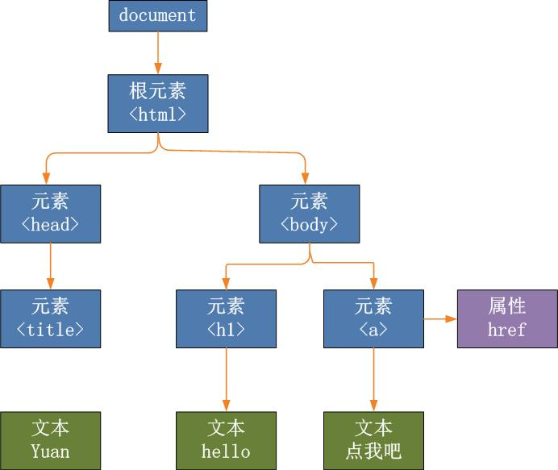

# 文档对象模型 - DOM
> 文档对象模型（Document Object Model，简称DOM），是W3C组织推荐的处理可扩展置标语言的标准编程接口
本文主要内容:
* 如何在文档中查询或选取单独的元素
* 如何将文档作为节点树来遍历，如何找到任何文档元素的祖先，兄弟和后代元素
* 如何查询和设置文档元素的属性
* 如何查询，设置和修改文档呢绒
* 如何通过创建，插入和删除节点来修改文档结构
* 如何与 HTML 表单一起工作
## DOM 概述
::: tip Document Object Model
每一个 window 对象有一个 document 属性引用了 Document 对象。 Document 对象表示窗口的内容，Document 对象并非独立的，它是一个巨大的 API 中的核心对象，叫做 文档对象模型（Document Object Model），代表和操作文档的内容。
:::
DOM 文档树

## 选取文档
### 通过 id 选取元素
```js
document.getElementById('ID')
// 返回一个 Element 对象
```
### 通过 name 属性选取元素
```js
document.getElementsByName('NAME')
// 返回一个 NodeList 对象
```
### 通过 标签名 选取元素
```js
document.getElementsByTagName('TAGNAME')
// 返回一个 NodeList 对象
```
### 通过 css 类选取元素
```js
document.getElementsByClassName('CLASSNAME')
// 返回一个 NodeList 对象
```
## 文档结构和遍历

## 属性

## 元素内容

## 创建、插入、和删除节点

## 列子: 生成目录表

## 文档和元素的几何形状和滚动

## HTML 表单

## 其他文档特性