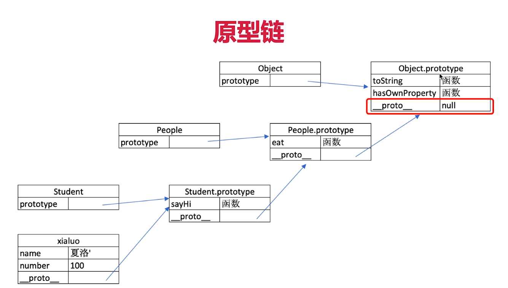

# OOP 面向对象编程
::: tip OOP
Object Oriented Programming 
:::
## 介绍
* 在程序里，我们通过使用对象去构建现实世界的模型，把原本很难（或不可）能被使用的功能，简单化并提供出来，以供访问
* 就是说把复杂的现实问题抽象为具体的数据模型，将公共的属性和方法抽离出来
## 定义一个对象模板(类)
> JS 中使用构造函数 定义（创建） 一个类
```js
// 定一个 Preson 的构造函数（类） 一般使用大写字母开头
function Person(name, age) {
  this.name = name
  this.age = age
}
// 实例化一个具体的人
var person1 = new Person('Sarah', 22)
```
## 对象原型
* JavaScript 常被描述为一种基于原型的语言 (prototype-based language)
* 每个对象拥有一个原型对象，对象以其原型为模板、从原型 **继承** 方法和属性
* 一层一层、以此类推。这种关系常被称为 **原型链** (prototype chain)
* **原型链** 解释了为何一个对象会拥有定义在其他对象中的属性和方法
* 这些属性和方法定义在Object的构造器函数(constructor functions)之上的 **prototype** 属性上
```js
// 给 Person 的 prototype 添加一个方法
Person.prototype.greeting = function() {
  alert('Hi! I\'m ' + this.name + '.')
}
person1.greeting() // Hi! I'm Sarah.
```
实例对象下有个隐式原型，执行他的构造函数的 prototype 属性
```js
person1.__proto__ === Person.prototype // true
```
## 原型链
* 当访问一个对象的属性时，首先会在自身的属性查找
* 如果没有找到，就向上一层（就是定义该对象的构造函数）上查找
* 如果还是没有找到，一次向上查找
* 最后, 原型链上面的所有的 \_\_proto\_\_ 都被找完了，都不存在，则返回 undefined


## JS 中的继承
1.通过 Object.create() 
```js
//定一个 Teacher 的类
function Teacher(name, age, subject) {
  Person.call(this, name, age);

  this.subject = subject;
}
Teacher.prototype = Object.create(Person.prototype)
Teacher.prototype.constructor = Teacher;
```
2.原型链继承
```js
function Teacher() {}
Teacher.prototype = new Person('Dave', 33)

```