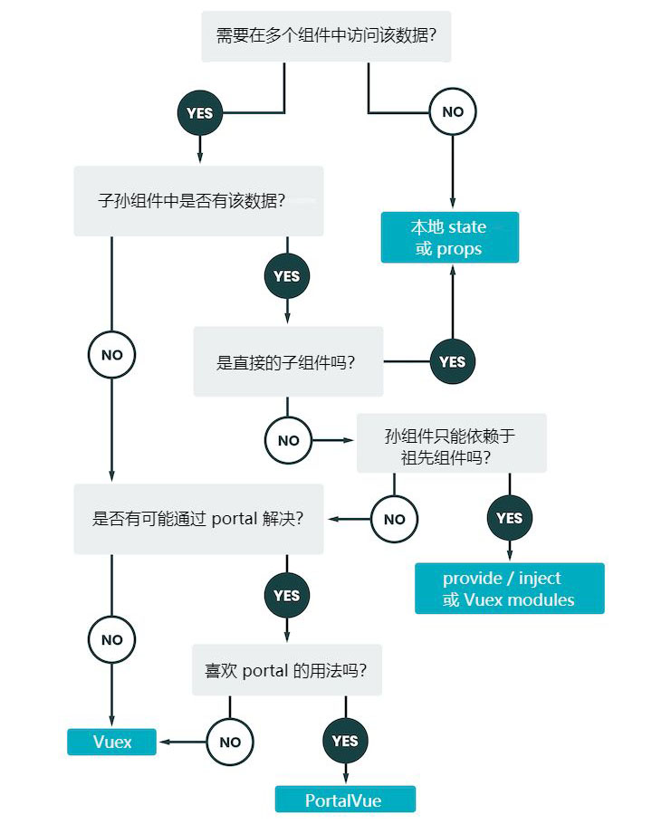

# Vuex
[[toc]]

## 概念
vuex 是实现组件全局状态（数据）管理的一种机制，可以方便的实现组件之间的数据共享
### 使用 vuex 统一管理状态的好处:
* 能够在 vuex 中集中管理共享的数据，易于开发和后期维护
* 能够高效地实现组件之间的数据共享，提供开发xiaol
* 存储在 vuex 中的数据都是响应式的，能够实时保持数据与页面的同步

### 什么样的数据适合存储在 vuex 中
* 一般情况下，只有组件之间共享的数据，才有必要存储在 vuex 中
* 对于组件中的私有数据，依旧存储在组件自身的 data 当中即可


## Vuex 的基本使用
1. 安装 Vuex 的依赖包
```shell
npm install vuex --save 
# yarn add vuex
```
2. 导入 Vuex 
```js
import Vuex from 'vuex'
Vue.use(Vuex)
```
3. 创建 store 对象
```js
const stroe = new Vuex.Stroe({
  // state 中存放的就是 全局共享数据
  state: { count: 0 }
})
```
4. 将 store 对象挂载到 vue 实例中
```js
new Vue({
  el: "#app",
  store
})
```
## 核心概念概述
Vuex 中的主要核心概念:
* State
* Mutation
* Action
* Getter
### State
> State 提供唯一的公共数据源，所有共享数据都要统一存放在 Stroe 的 State 中进行存储
组件访问 State 中数据的第一种方式：
```js
this.$store.state.DATANAME 
```
组件访问 State 中数据的第二中方式：
```js
import { mapState } from 'vuex'
```
通过导入的 mapState 函数，将当前组件需要的全局数据，映射为当前组件的 computed 计算属性中：
```js
computed: {
  ...mapState(['DATANAME'])
}
```
### Mutation
Mutation 用于变更 Store 中的数据, 可以集中监控所有数据的变化
::: warning 提示
不可直接操作 Store 中的数据，因为不好追溯到底是具体那个组件改变的数据
:::
定义 Mutations
```js
const store = new Vuex.Store({
  state: { count: 0 },
  mutations: {
    add (state) {
      state.count++
    }
  }
})
```
触发 mutation 的第一种方式
```js
methods: {
  handle() {
    this.$store.commit('add')
  }
}
```
可以在触发 mutations 时传递参数
```js
mutations: {
  addN(state, step) { state.count += step }
}

this.$store.commit('addN', 10)
```
触发 mutation 的第二种方式
```js
import { mapMutations } from 'vuex'

methods: {
  ...mapMutations(['add', 'addN']),
  handle1() {
    this.add()
  },
  handle2() {
    this.addN(3)
  }
}
```
### Ation
::: tip Ation 用于处理异步任务
通过异步操作变更数据，必须通过 Ation，而不能使用 Moutation， 但是在 Ation 中还是要通过触发 Moutation 的方式间接变更数据
:::
定义 Ations
```js
const store = new Vuex.store({
  // ...
  mutations: {
    add(state) {
      state.count++
    }
  },
  acitons: {
    addAsync(context) {
      setTimeout(()=> {
        context.commit('add')
      }, 1000)
    }
  }
})
```
触发 actions 的第一种方式：
```js
methods: {
  handle() {
    this.$store.dispatch('addAsync')
  }
}
```
携带参数时：
```js
// 定义
acitons: {
  addAsync(context, step) {
    setTimeout(()=> {
      context.commit('addN', step)
    }, 1000)
  }
}

// 触发
this.$store.dispatch('addAsync', 10)
```
触发 actions 的第二种方式：
```js
import { mapActions } from 'vuex'

methods: {
  ...mapActions(['addAsync', 'addNsync'])
}
```
### Getter
* Getter 用于对 Store 中的数据进行加工处理形成新的数据
* Getter 可以对 Store 中已有的数据加工处理后形成新的数据，类似 Vue 的计算属性
* Store 中数据发送改变， Getter 的数据也会跟着变化
```js
// 定义 Getter 
const store = new Vuex.Store({
  state: {
    count: 0
  },
  getters: {
    showNums: state => {
      return `当前最新的 count 值为: ${state.count}`
    }
  }
})
// 获取 getters 的第一种方式
this.$store.getters.showNums

// 第二种方式：
import { mapGetters } from 'vuex'

export default {
  // ...
  computed: {
    ...mapGetters(['showNums'])
  }
}
```
